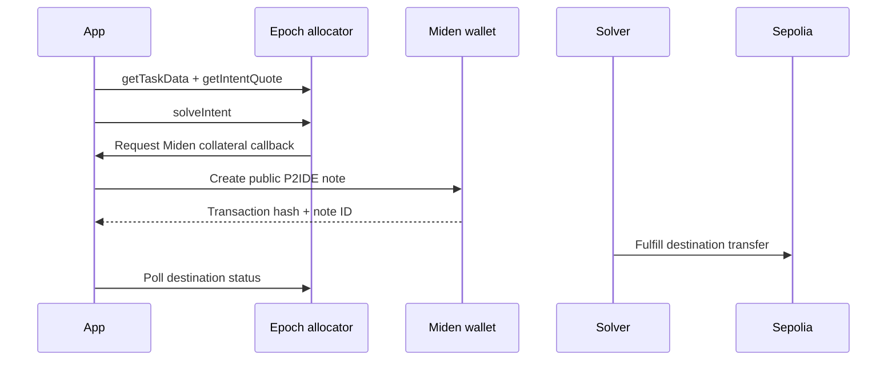
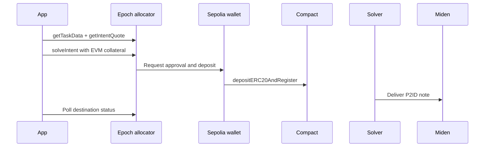

# Epoch on Miden

Epoch gives a Miden application an intent-based bridge surface: request a
quote, let the user authorize the source collateral, submit the intent, and
track the solver's destination transaction.

The current reference integration supports Epoch test USDC between Miden
testnet and Ethereum Sepolia in both directions, with a typical testnet time of
1–3 minutes.

<Callout variant="info" title="Why the Miden guide includes implementation">
Epoch's SDK documentation defines the provider workflow. This guide owns the
Miden-specific integration: virtual chain configuration, P2IDE collateral,
wallet callbacks, destination-aware completion, and note recovery.
</Callout>

<Callout variant="warn" title="Epoch test USDC">
The Sepolia token in this integration is Epoch's 18-decimal test token, not
Circle's canonical Sepolia USDC. It maps to a 6-decimal USDC faucet on Miden.
Do not interchange the addresses or decimal assumptions.
</Callout>

## Why Epoch is faster

Epoch's allocator and solver coordinate the destination leg after the source
collateral is authorized. The application does not wait for the canonical
Agglayer exit and claim lifecycle, which produces a faster testnet experience.

The tradeoff is an additional provider boundary: quoting, observation, solver
availability, and destination fulfillment depend on Epoch services. Treat the
1–3 minute range as an estimate, not an SLA.

## Dependencies

```bash
npm install @epoch-protocol/epoch-intents-sdk \
  @miden-sdk/miden-sdk \
  @miden-sdk/miden-wallet-adapter-base \
  @miden-sdk/miden-wallet-adapter-react \
  viem
```

The snippets are type-checked against
`@epoch-protocol/epoch-intents-sdk@1.0.39`,
`@miden-sdk/miden-sdk@0.15.7`, Miden wallet adapter `0.15.1`, and
`viem@2.51.0`.

The current reference uses:

```typescript
export const EPOCH_ALLOCATOR_URL =
  "https://testnet-dev.epochprotocol.xyz";
export const MIDEN_CHAIN_ID = 999999999;
export const SEPOLIA_CHAIN_ID = 11155111;
```

## Initialize the SDK per direction

The wallet client chain ID tells Epoch which side supplies the collateral:

- Use virtual chain ID `999999999` for Miden → EVM.
- Keep the real Sepolia chain ID for EVM → Miden.

```typescript
import { EpochIntentSDK } from "@epoch-protocol/epoch-intents-sdk";
import {
  createWalletClient,
  custom,
  type Chain,
  type EIP1193Provider,
} from "viem";
import { sepolia } from "viem/chains";

export function createEpochSdk(
  account: `0x${string}`,
  provider: EIP1193Provider,
  source: "miden" | "sepolia",
) {
  const chain: Chain =
    source === "miden"
      ? { ...sepolia, id: MIDEN_CHAIN_ID }
      : sepolia;
  const walletClient = createWalletClient({
    account,
    chain,
    transport: custom(provider),
  });

  return new EpochIntentSDK({
    apiBaseUrl: EPOCH_ALLOCATOR_URL,
    walletClient,
  });
}
```

For Miden-source flows the EVM account acts as the intent sponsor; it does not
supply the collateral. Do not reuse the virtual-chain override for EVM-source
intents. The reverse direction signs against the connected Sepolia wallet and
therefore needs chain ID `11155111`.

## Miden → EVM



### 1. Use the allocator's reclaim window

Epoch SDK 1.0.39 supplies `recallBlocks` and `bindingAttachmentFelts` to the
collateral callback. Compute the absolute reclaim height from the chain head
when creating the note. Do not put a precomputed reclaim height in the intent.
The attachment binds the collateral to the intent and must be written unchanged.

### 2. Build and quote the intent

```typescript
import { TaskType, MIDEN_TO_EVM_EXTRA_TYPESTRING, EVM_TO_MIDEN_EXTRA_TYPESTRING } from "@epoch-protocol/epoch-intents-sdk";

const task = await sdk.getTaskData({
  taskType: TaskType.GetTokenOut,
  intentData: {
    isNative: false,
    depositTokenAddress: ZERO_ADDRESS,
    tokenInAmount: midenAmountInBaseUnits,
    outputTokenAddress: epochSepoliaUsdcAddress,
    minTokenOut: minimumEvmOutput,
    destinationChainId: String(SEPOLIA_CHAIN_ID),
    protocolHashIdentifier: ZERO_HASH,
    recipient: evmRecipient,
  },
  extraDataTypestring: MIDEN_TO_EVM_EXTRA_TYPESTRING,
  extraData: {
    midenSourceAccount,
    midenFaucetId,
    midenNoteType: "P2IDE",
    midenNoteId: "",
  },
});

const quote = await sdk.getIntentQuote({
  sponsorAddress: evmRecipient,
  taskTypeString: task.taskTypeString,
  intentData: task.intentData,
  isNative: false,
});
```

Amounts in the intent envelope are base-unit strings. Do not apply display
decimals twice.

### 3. Create the Miden collateral note

Epoch calls `createMidenP2IDENote` during `solveIntent`. The callback must create
a **public, reclaimable P2IDE** note so the solver can observe it and the user
can recover funds if the intent expires.

```typescript
import {
  AccountId,
  AccountInterface,
  NetworkId,
  FungibleAsset, Note, NoteArray, NoteAssets, NoteAttachment, NoteType,
  TransactionRequestBuilder, Word,
} from "@miden-sdk/miden-sdk";
import { Transaction } from "@miden-sdk/miden-wallet-adapter-base";

/** Fresh fee-conversion salt for custom requests, also used as a multisig replay guard. */
function createFeeConversionSalt(): Word {
  const felts = new BigUint64Array(4);
  for (let i = 0; i < felts.length; i++) {
    // Word requires canonical Goldilocks field elements. Reject the tiny
    // out-of-field range instead of rounding or reducing random values.
    do {
      crypto.getRandomValues(felts.subarray(i, i + 1));
    } while (felts[i] >= 18_446_744_069_414_584_321n);
  }
  return new Word(felts);
}

function toTestnetAccountAddress(value: string) {
  return value.startsWith("0x")
    ? AccountId.fromHex(value).toBech32(
        NetworkId.testnet(),
        AccountInterface.BasicWallet,
      )
    : value;
}

const createMidenP2IDENote = async (
  faucetId: string,
  amount: string,
  allocatorId: string,
  recallBlocks: number,
  bindingAttachmentFelts: bigint[],
) => {
  const currentBlock = await getCurrentMidenBlock();
  const reclaimHeight = currentBlock + recallBlocks;
  if (!Number.isSafeInteger(reclaimHeight) || recallBlocks <= 0 ||
      reclaimHeight > 0xffff_ffff || bindingAttachmentFelts.length === 0) {
    throw new Error("Invalid Epoch collateral parameters");
  }
  const toAccountId = (value: string) => value.startsWith("0x")
    ? AccountId.fromHex(value) : AccountId.fromBech32(value);
  const note = Note.createP2IDENote(
    toAccountId(midenSourceAccount),
    toAccountId(allocatorId),
    new NoteAssets([new FungibleAsset(toAccountId(faucetId), BigInt(amount))]),
    reclaimHeight,
    null,
    NoteType.Public,
    new NoteAttachment(BigUint64Array.from(bindingAttachmentFelts)),
  );
  const expectedNoteId = note.id().toString();
  const request = new TransactionRequestBuilder()
    .withFeeConversionSalt(createFeeConversionSalt())
    .withOwnOutputNotes(new NoteArray([note]))
    .build();
  const requestId = await requestTransaction(Transaction.createCustomTransaction(
    midenSender, toTestnetAccountAddress(allocatorId), request,
  ));
  const output = await waitForTransaction(requestId);
  const noteId = output.outputNotes?.find(
    (outputNote) => outputNote.id().toString() === expectedNoteId,
  )?.id().toString();
  return noteId ? { success: true, noteId } : { success: false };
};
```

The custom transaction preserves the SDK attachment and keeps the amount as a
`bigint`. Match the collateral note by ID because a transaction can also emit a
fee note. `requestSend` cannot carry the required attachment.

### 4. Solve and track the destination

```typescript
import { CollateralType } from "@epoch-protocol/epoch-intents-sdk";

const result = await sdk.solveIntent({
  isNative: false,
  sponsorAddress: evmRecipient,
  taskTypeString: task.taskTypeString,
  intentData: task.intentData,
  quoteResult: quote,
  collateralType: CollateralType.Miden,
  midenFaucetId,
  midenSourceAccount,
  createMidenP2IDENote,
});
```

Persist the sponsor address and intent nonce returned by the solve result.
Poll `getIntentStatus(sponsorAddress, nonce)` and mark the transfer complete
only after a successful Sepolia row has a destination transaction hash and no
Sepolia row remains pending.

## EVM → Miden



### 1. Build the reverse task

```typescript
const task = await sdk.getTaskData({
  taskType: TaskType.GetTokenOut,
  intentData: {
    isNative: false,
    depositTokenAddress: epochSepoliaUsdcAddress,
    tokenInAmount: evmAmountInBaseUnits,
    outputTokenAddress: ZERO_ADDRESS,
    minTokenOut: minimumMidenOutput,
    destinationChainId: String(MIDEN_CHAIN_ID),
    protocolHashIdentifier: ZERO_HASH,
    recipient: evmSourceAddress,
  },
  extraDataTypestring: EVM_TO_MIDEN_EXTRA_TYPESTRING,
  extraData: {
    midenRecipientAccount,
    midenFaucetId,
  },
});
```

Use `EVM_TO_MIDEN_EXTRA_TYPESTRING` from the Epoch SDK for this direction.
The allocator delivers to the Miden recipient; no collateral callback is needed.

### 2. Quote and solve with EVM collateral

```typescript
const quote = await sdk.getIntentQuote({
  sponsorAddress: evmSourceAddress,
  taskTypeString: task.taskTypeString,
  intentData: task.intentData,
  isNative: false,
});

const result = await sdk.solveIntent({
  isNative: false,
  sponsorAddress: evmSourceAddress,
  taskTypeString: task.taskTypeString,
  intentData: task.intentData,
  quoteResult: quote,
  collateralType: CollateralType.EVM,
});
```

The SDK may first request an ERC-20 approval and then
`depositERC20AndRegister` against Compact. Surface those as separate wallet
phases so the interface does not appear frozen.

Poll the intent until the Miden destination row settles. An intermediate
Compact or allocator success is not destination completion.

## Recovery

Persist the source transaction hash, sponsor address, intent nonce, direction,
and destination chain ID. The SDK also exposes recovery operations for failed
or cancelled flows:

- `retryIntentSolve` retries a transient solver failure.
- `disableForcedWithdrawal` clears a pending forced-withdrawal state before
  reusing a Compact deposit.
- `withdrawToken` reclaims an unfulfilled EVM-side deposit.
- `initateDepositWithdrawal` starts forced withdrawal. The exported method name
  currently contains that spelling.

Do not hide these states behind a generic "try again" button. Show which
resource is locked and which recovery transaction will be signed.

## Frontend integration constraints

- Await `waitForTransaction` before reading a Miden output note ID.
- Keep P2IDE collateral public so the allocator can observe it.
- Dynamically import Miden/Epoch execution code in SSR applications because the
  Miden SDK initializes WASM eagerly.
- Do not enable COOP/COEP with the current wallet-popup and Miden gRPC-Web
  transport stack.
- Use a destination-aware polling reducer; source settlement is not completion.

## Continue with Epoch

<CardGrid cols={2}>
  <Card title="Miden integration example ↗" href="https://docs.epochprotocol.xyz/integration-examples#miden-integration-example" eyebrow="Official · Provider">
    Review Epoch's current Miden task data, collateral model, and supported
    provider workflow.
  </Card>
  <Card title="Epoch SDK integration guide ↗" href="https://docs.epochprotocol.xyz/integration-guides/sdk-integration-guide" eyebrow="Official · SDK">
    Check current SDK initialization, quoting, submission, status, and recovery
    APIs.
  </Card>
</CardGrid>

### Miden implementation references

- [Epoch integration in the bridge portal](https://github.com/0xMiden/bridge-portal/tree/main/src/app/lib/epoch)
- [Full Epoch bridging tutorial](../../tutorials/recipes/web/bridging_with_epoch_tutorial.md)
- [Runnable bridging application](https://github.com/0xMiden/tutorials/tree/main/examples/bridging-app)
- [Epoch SDK reference](https://docs.epochprotocol.xyz/integration-guides/sdk-reference)
- [Supported chains and tokens](https://docs.epochprotocol.xyz/supported-chains-and-tokens)
